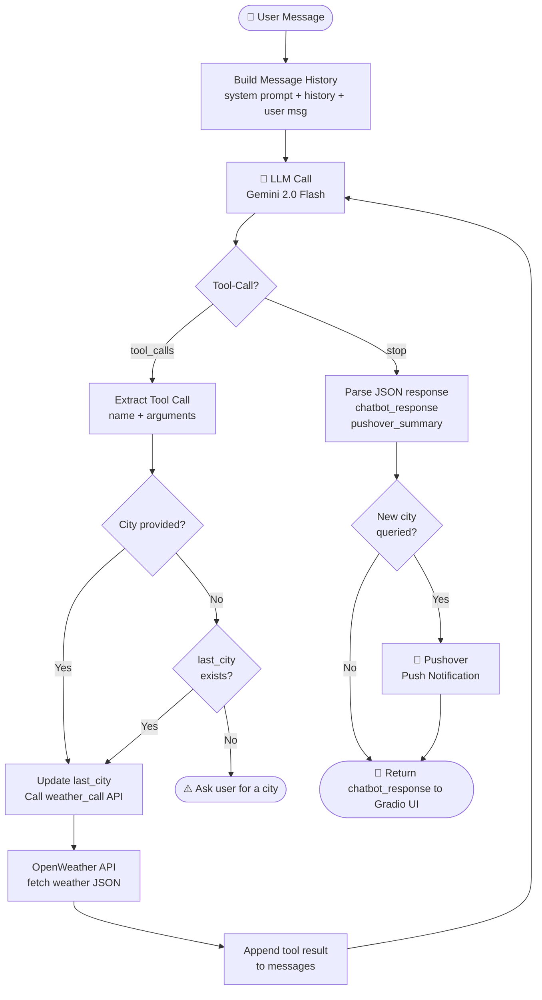

# Weather Alert Chatbot

A conversational weather assistant that answers weather-related questions and sends push notifications to your device via Pushover.

## What It Does

- Accepts natural language weather queries (e.g. *"How's the weather in Delhi?"*, *"Should I carry an umbrella?"*)
- Fetches real-time weather data from the OpenWeather API
- Uses Gemini 2.0 Flash (via OpenAI-compatible SDK) to interpret the data and generate a friendly response
- Sends a short push notification to your device via Pushover whenever a new city is queried
- Remembers the last city discussed, so follow-up questions don't need to repeat it

## Prerequisites

- Python 3.8+
- A [Pushover](https://pushover.net/) account (app token + user key)
- An [OpenWeather](https://openweathermap.org/api) API key
- A [Google Gemini](https://aistudio.google.com/) API key

## Setup

1. **Install dependencies**
   ```bash
   pip install requests openai gradio python-dotenv
   ```

2. **Create a `.env` file** in the project root:
   ```env
   PUSHOVER_TOKEN=your_pushover_app_token
   PUSHOVER_USER=your_pushover_user_key
   OPENWEATHER=your_openweather_api_key
   GOOGLE_GEMINI=your_gemini_api_key
   ```

3. **Update the device name** in `push()` if needed:
   ```python
   'device': 'YourDeviceName'
   ```

## Running

```bash
python weather_bot.py
```

This launches a Gradio chat interface in your browser. Type any weather-related question to get started.

## Workflow

### Diagram



### How It Works

**1. Message Construction**
Every time the user sends a message, the `chat()` function builds a full message list from scratch: the system prompt, an optional reminder of the last city discussed, the full conversation history, and the new user message. This gives the LLM full context on every call.

**2. LLM Call**
The message list is sent to Gemini via the OpenAI-compatible SDK. The model is given access to the `weather_call` tool and can decide on its own whether to call it.

**3. Tool Call Handling**
If the LLM responds with `finish_reason = tool_calls`, the bot extracts the function name and arguments (typically a city name). It then:
- Updates `last_city` if a new city was mentioned
- Falls back to `last_city` if no city was provided (enabling follow-up questions)
- Calls `weather_call(city)` to hit the OpenWeather API

The raw weather JSON is appended to the message history as a user message, and the loop sends everything back to the LLM again.

**4. Final Response**
Once the LLM responds with `finish_reason = stop`, the bot parses the JSON output — which always contains a `chatbot_response` (shown in the UI) and a `pushover_summary` (sent as a push notification if the city is new).

**5. Push Notification**
The `push()` function fires only when a new city is introduced, avoiding duplicate notifications for follow-up questions about the same location.

---

## Example Queries

- *"What's the weather like in Tokyo?"*
- *"Is it a good day for cricket in Mumbai?"*
- *"Should I bring a jacket?"* (after a city has been mentioned)
